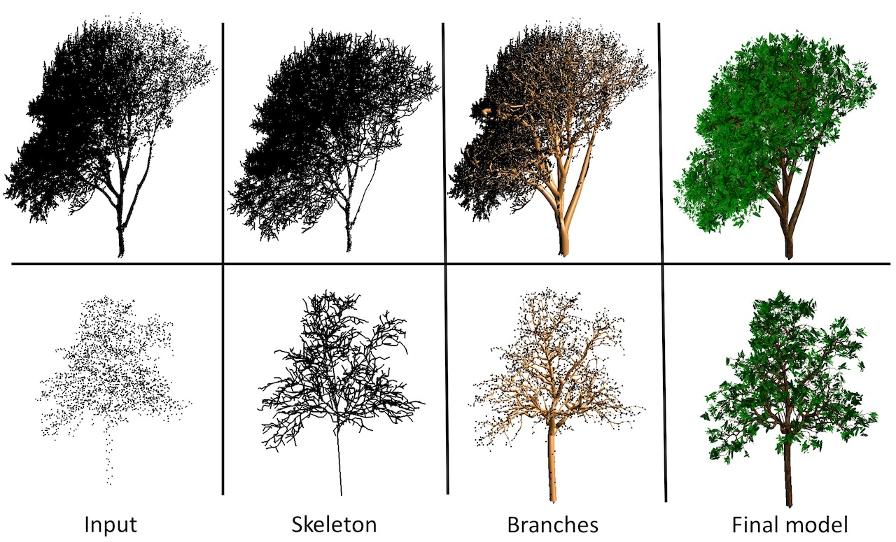
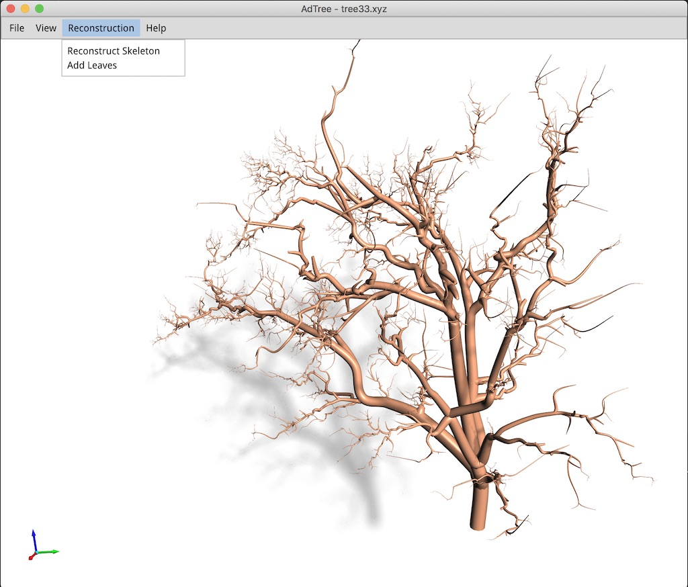

<p align="right">
    <b>  </b> <br>
    <b>  </b> <br> <br>
</p>


AdTree implements the tree reconstruction method described in the following [paper](https://3d.bk.tudelft.nl/liangliang/publications/2019/adtree/AdTree_RS-2019.pdf):
```
Shenglan Du, Roderik Lindenbergh, Hugo Ledoux, Jantien Stoter, and Liangliang Nan.
AdTree: Accurate, Detailed, and Automatic Modelling of Laser-Scanned Trees.
Remote Sensing. 2019, 11(18), 2074.
```


<p align="center">3D tree models reconstructed from point clouds</p>

### Build and Run AdTree
Prebuilt executables (for **macOS**, **Linux**, and **Windows**) can be downloaded 
[here](https://github.com/tudelft3d/adtree/releases). 

AdTree depends on some third-party libraries and most dependencies are included in the distribution except 
[Boost](https://www.boost.org/). So you will need to have Boost installed first. 

Note: AdTree uses a stripped earlier version of [Easy3D](https://github.com/LiangliangNan/Easy3D), which is not 
compatible with the latest version.

You need [CMake](https://cmake.org/download/) and of course a compiler to build AdTree:

- CMake `>= 3.1`
- a compiler that supports `>= C++11`

AdTree has been tested on macOS (Xcode >= 8), Windows (MSVC >=2015), and Linux (GCC >= 4.8, Clang >= 3.3). Machines 
nowadays typically provide higher [support](https://en.cppreference.com/w/cpp/compiler_support), so you should be 
able to build AdTree on almost all platforms.

There are many options to build AdTree. Choose one of the following (or whatever you are familiar with):

- Option 1: Use any IDE that can directly handle CMakeLists files to open the `CMakeLists.txt` in the root directory 
of AdTree. Then you should have obtained a usable project and just build. I recommend using
 [CLion](https://www.jetbrains.com/clion/) or [QtCreator](https://www.qt.io/product). For Windows users: your IDE must be set for `x64`.
 
- Option 2: Use CMake to generate project files for your IDE. Then load the project to your IDE and build. For Windows users: your IDE must be set for `x64`.

- Option 3: Use CMake to generate Makefiles and then build (purely command line).
  - on Linux or macOS:
    ```
    $ cd path-to-root-dir-of-AdTree 
    $ mkdir Release
    $ cd Release
    $ cmake -DCMAKE_BUILD_TYPE=Release ..
    $ make
    ```
  - on Windows with Microsoft Visual Studio, use the `x64 Native Tools Command Prompt for VS XXXX` (don't use the x86 one), then
    ```
    $ cd path-to-root-dir-of-AdTree 
    $ mkdir Release
    $ cd Release
    $ cmake -G "NMake Makefiles" -DCMAKE_BUILD_TYPE=Release ..
    $ nmake
    ```

Don't have any experience with C/C++ programming? Have a look at [How to build AdTree step by step](./How_to_build.md).

After obtaining the executable, AdTree can be run in three modes, which can be selected based 
on arguments.
  - GUI mode. It provides a user interface with menus. You can double-click the app or run it from the commandline
    ```
    ./AdTree
    ```
    
  - Commandline single processing mode (i.e., processing a single point cloud file).
    ```
    ./AdTree  <xyz_file_path>  <output_directory>  [-s|-skeleton]
    ```
    - `<xyz_file_path>`: a mandatory argument specifying the path to the input point cloud file
    - `<output_directory>`: a mandatory argument specifying where to save the results
    - `[-s]` or `[-skeleton]`: also export the skeletons (omit this argument it if you don't need skeletons)

  - Commandline batch processing mode (i.e., all *.xyz files in an input directory will be processed).
    ```
    ./AdTree  <xyz_files_directory>  <output_directory>  [-s|-skeleton]
    ```
     - `<xyz_files_directory>`: a mandatory argument specifying the directory containing the input point cloud files
     - `<output_directory>`: a mandatory argument specifying where to save the results
     - `[-s]` or `[-skeleton]`: also export the skeletons (omit this argument it if you don't need skeletons)

<p align="center"> 
      
</p>
 

---

### Data
Some test tree point clouds are provided in the '[data](./data)' folder.

**Note:** When testing on your point clouds, please make sure that:
 - your point cloud represents a single tree (i.e., the tree is segmented out from the background; no ground, no fence...);
 - the tree has an upright orientation (i.e., with Z-axis pointing up).

---

### About the output
AdTree outputs 3D models of the reconstructed branches (and also leaves) as triangle meshes 
in the [OBJ format](https://en.wikipedia.org/wiki/Wavefront_.obj_file).

It also supports to output the reconstructed skeletons as generalized cylinders (i.e., the two endpoints of an edge have
different radii) in the [PLY format](https://en.wikipedia.org/wiki/PLY_(file_format)). In this format, each branch is 
represented by a sequence of generalized cylinders, and each vertex is associated with a `radius' property. Please note 
that most tools (like CloudCompare and MeshLab) do not support this format. You can use [Mapple](https://github.com/LiangliangNan/Easy3D/releases/tag/v2.5.2) (or one of the example viewers in [Easy3D](https://github.com/LiangliangNan/Easy3D))
to visualize the exported skeletons (see an example visualization [here](https://github.com/tudelft3d/AdTree/issues/16#issuecomment-1410001785)).

---

### Citation
If you use the code/program (or part) of AdTree in scientific work, please cite our paper:

```bibtex
@article{du2019adtree,
  title={AdTree: Accurate, detailed, and automatic modelling of laser-scanned trees},
  author={Du, Shenglan and Lindenbergh, Roderik and Ledoux, Hugo and Stoter, Jantien and Nan, Liangliang},
  journal={Remote Sensing},
  volume={11},
  number={18},
  pages={2074},
  year={2019}
}
```

---

### License
This program is free software; you can redistribute it and/or modify it under the terms of the GNU General Public License as published by the Free Software Foundation; either version 3 of the License or (at your option) any later version. The full text of the license can be found in the accompanying LICENSE file.

---

Should you have any questions, comments, or suggestions, please contact us at liangliang.nan@tudelft.nl

3D Geoinformation Research Group, TU Delft,

https://3d.bk.tudelft.nl,

Dec. 1, 2019
